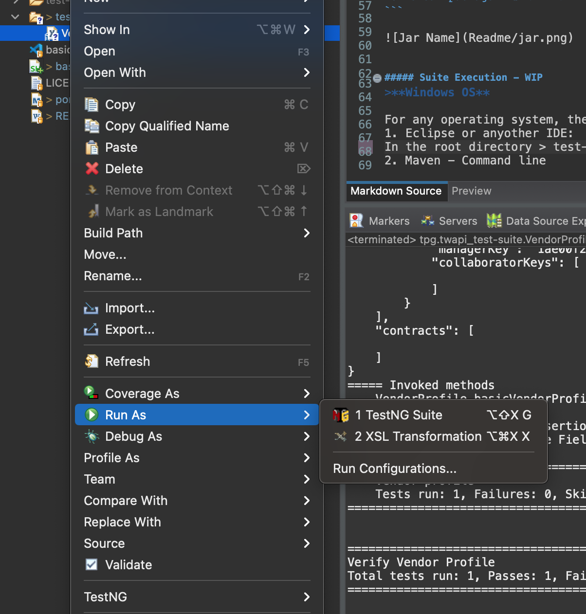

# Venminder - Open API Test Automation Framework
Basic Test Automation framework for Venminder's Open API Project

- This framaework incorporates Rest Assured API's library for easy test creation
- This framework also uses Maven for Project and dependency management
- TestNG framework is incorporated to manages Test cases and Test Suites

### Pre-Requisites
Please install the listed versions to avoid any excceptions while execution of Test Suite

>NOTE: This is considering you are working on a 64-bit OS with Eclipse IDE installed and configured with TestNG beforehand (Please refer to [Eclipse Downloads](https://www.eclipse.org/downloads/) [TestNG](https://www.guru99.com/install-testng-in-eclipse.html))

- **Java** : Version 8
- **Apache Maven** : 3.6.3

```bash
git clone git@github.com:sudosingh-tpg/tpg.twapi.git
cd tg.twapi
```

##### Build Profiles
Maven Build Profiles allow you to execute and compile the tests for any given environment
For this you need to add profiles in the POM file
<pre><code>
&lt;profiles&gt;  
  &lt;profile&gt;  
  	&lt;id&gt;SAND-DEV&lt;/id&gt;  
  	&lt;properties&gt;  
  		&lt;build.profile.id&gt;SAND-DEV&lt;/build.profile.id&gt;  
  	&lt;/properties&gt;  
  	&lt;build&gt;  
  	&lt;finalName&gt;${project.artifactId}-SAND-DEV&lt;/finalName&gt;  
  	&lt;/build&gt;  
  &lt;/profile&gt;  
  &lt;/profiles&gt;  
</code></pre>
Here the build.profile.id helps in specifying which environment's properties should be compiled while building the project
<pre><code>
&lt;resources&gt;
  	&lt;resource&gt;
  		&lt;filtering&gt;true&lt;/filtering&gt;
  		&lt;directory&gt;profiles/${build.profile.id}&lt;/directory&gt;
  	&lt;/resource&gt;
  &lt;/resources&gt;
</pre></code>

Example:

```bash
mvn compile -PSAND-DEV
```

The finalname helps in setting a file name for the packaged jar of the build

```bash
mvn clean package -PSAND-DEV
```


 

##### Suite Execution - WIP

For any operating system, there are a couple of ways to execute the created Suite
1. Eclipse or anyother IDE:  
In the root directory > test-suite folder, there are Test Suites. We can right click any suite that we want and run it as testNG Suite


2. Maven - Command line
Navigate to the root directory and:

```bash
chmod +x ./basicexec.sh
```
to provide execute permissions to the user if you are on a MacOS or a Linux OS then:  

```bash
./basicexec.sh environmentID suiteFileName.xml
```

If on a WindowsOS:

```bash
./basicexec.bat environmentID suiteFileName.xml
```